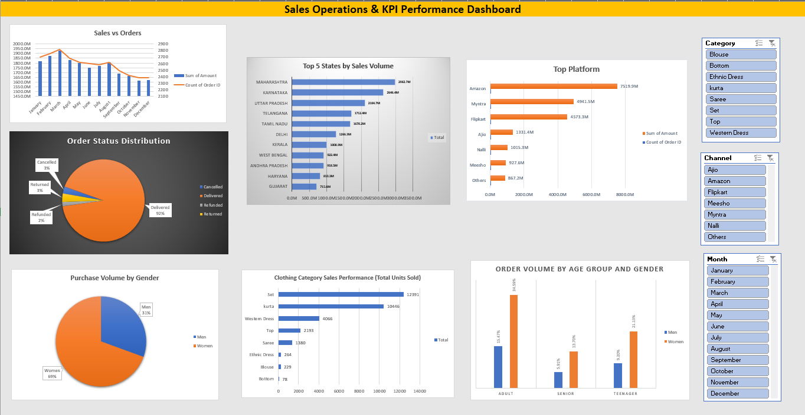

# Sales Operations & KPI Performance Dashboard (Excel)

This project simulates an operational reporting environment where raw transactional sales data is cleaned, validated, and transformed into KPI-driven insights. It focuses on ensuring data reliability, enabling performance visibility, and supporting business decision-making through structured reporting.

The project reflects real-world business operations workflows, including data standardization, KPI tracking, and dashboard-based performance monitoring.

---

## Project Overview

Domain: Sales Operations  
Tool: Microsoft Excel  
Project Type: Data Analytics / Operational Reporting  

The dataset represents multi-channel sales transactions across product categories, customer segments, and regions. The project involves preparing data for reporting, ensuring consistency, and building an interactive dashboard to monitor key operational metrics.

---

## Dashboard Preview

---

## Analytical Workflow

1. Cleaned and validated raw transactional data  
2. Standardized business dimensions (channels, categories, order status)  
3. Structured dataset for consistent KPI reporting  
4. Created pivot tables for multi-dimensional analysis  
5. Built an interactive dashboard for performance monitoring  
6. Derived business insights from operational data  

---

## KPI Dashboard Features

- Total sales and order volume tracking  
- Channel-wise performance analysis  
- Category-level revenue distribution  
- Customer segmentation insights  
- Order status and fulfillment tracking  
- Time-based performance trends  

---

## Data Quality & Validation

- Handled missing and inconsistent data entries  
- Standardized categorical fields for accurate reporting  
- Ensured consistency across key business dimensions  
- Structured data for repeatable and reliable reporting workflows  

---

## Business Impact

- Enabled visibility into performance across channels and customer segments  
- Supported identification of high-performing products and categories  
- Improved understanding of order fulfillment and operational efficiency  
- Strengthened reporting accuracy for business decision-making  

---

## Key Insights

- Female customer segment contributes significantly to overall sales  
- High delivery success rate indicates efficient order fulfillment  
- Maharashtra shows highest demand → potential region-focused strategy  
- Amazon dominates as primary sales channel → platform dependency insight  
- Sets and Kurtas contribute major share of fashion revenue  
- March and August show peak sales trends  

---

## Project Structure

sales_operations_dashboard.xlsx – Excel dashboard file  

---

## How to Use

1. Open `sales_operations_dashboard.xlsx`  
2. Use slicers to filter data by time, category, and channel  
3. Analyze KPIs and trends for performance insights  

---

## Skills Demonstrated

- Data cleaning and validation in Excel  
- KPI reporting and dashboard development  
- Pivot tables for multi-dimensional analysis  
- Operational data analysis and performance tracking  
- Business insight generation and reporting  
- Structured data preparation for analytics  

---

## Possible Extensions

- Automate reporting using Power BI  
- Integrate data from SQL or external databases  
- Add forecasting models for sales prediction  
- Enhance dashboard with advanced Excel features (Power Query, Power Pivot)  

---

## Author

Yadnyesh Thakare  
LinkedIn: https://linkedin.com/in/yadnyesh-thakare  
Email: thakareyadnyesh@gmail.com  

---

## Summary

This project demonstrates the ability to transform raw operational data into structured, reliable reporting systems. It highlights practical skills in data validation, KPI tracking, and dashboard development aligned with real-world business operations and analytics roles.
